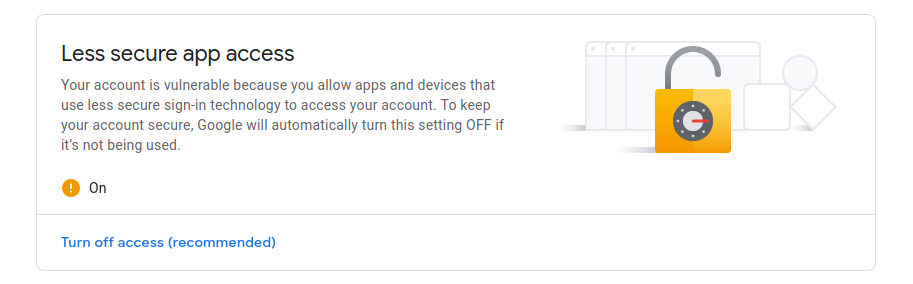
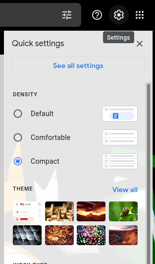
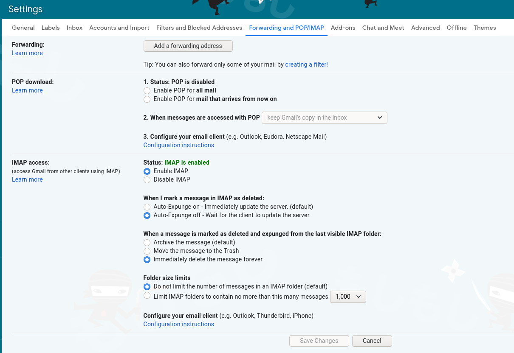

# Inbox-Cleaner
Python3 script to clean gmail inbox. Works with Linux and Windows

## Allowing Less Secure Apps Access to Gmail Account
1. Goto Gmail Account settings


2. Then, click Security


3. Scroll down till you see less secure apps and turn on


4. After that, go into Gmail and click settings button > See all settings



5. Last, click Forwarding and POP/IMAP, enable IMAP, turn off auto-expunge, immediately delete then save changes and exit



## Usage

1. Download repo:
```sh
git clone https://github.com/AaronE90/Inbox-Cleaner.git
```
2. Change directory:
```sh
cd Inbox-Cleaner
```
3. Install Requirements:
```sh
python3 -m pip install -r requirements.txt
```
4. Run script:
```sh
python3 IMap-script.py
```

#### My First Python Script
This is my first python script. Made because there was over 30,000 unreads emails in my inbox. 
More scripts on the way with more learning studying I will be doing. 

Thanks for stopping by :)
